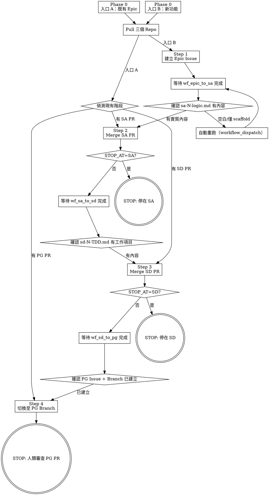

# Epic Launcher

啟動 P1 完整功能開發流程：與發起者確認需求共識 → 建立 Epic → SA merge → SD merge → PG 停止等待人類審查，並輸出各階段報告。

## 前置條件

- `gh` CLI 已認證，有 MPinfo-Co org 存取權

---

## 執行原則

遇到問題時優先自我判斷處理，不輕易停止。包括但不限於：
- workflow 輸出為空 → 分析 log 後重跑，而非等待人工指示
- API 呼叫失敗 → 重試，確認是暫時性錯誤後再決定是否回報
- 步驟卡住 → 先確認是否有其他途徑繞過，再考慮停止

**只有在以下情況才停止並回報：**
- 錯誤持續超過 3 次重試且無法判斷根因
- 操作具有不可逆風險（如誤 merge、刪除 branch）
- 需要人類提供的資訊才能繼續

---

## 重跑 Workflow 原則

執行過程中若需重跑任何 workflow，一律使用 `workflow_dispatch`，不要用 GitHub UI 的 Re-run：

```bash
gh workflow run <workflow>.yml --repo <repo>
# 例：gh workflow run wf_epic_to_sa.yml --repo MPinfo-Co/P1-project
```

---

## Merge 策略說明

| Repo | allow_merge_commit | 正確 flag | --admin 必要？ |
|------|-------------------|-----------|---------------|
| MPinfo-Co/P1-design | ❌ 停用 | `--squash` | 否（無 required review） |
| MPinfo-Co/P1-code | ❌ 停用 | `--squash` | 是（有 required review，PG PR 由人類審查後執行） |

- 使用 `gh pr merge --merge` 會被 GitHub 以 422 拒絕，錯誤訊息為 "Merge commits are not allowed"
- P1-code 的 PG PR 不在此 skill 中 merge，由人類審查後手動處理

---

## 執行流程



---

## Phase 0：需求共識確認

### 共同前置：Pull 三個 Repo

無論哪條入口，先執行：

```bash
P1_BASE=/Users/rex/Desktop/P1
for repo in P1-project P1-design P1-code; do
  echo "=== $repo ==="
  git -C "$P1_BASE/$repo" pull
done
```

若任一 repo pull 失敗，重試最多 3 次，仍失敗才停止並回報。

---

### 入口 A：提供既有 Epic Issue #no（接續執行）

啟動者直接告知 Epic issue 編號（如 `#42`），跳過需求確認，直接偵測現在在哪個階段：

```bash
EPIC_NUMBER=<啟動者提供的號碼>

# 取得 Epic 標題
EPIC_TITLE=$(gh issue view $EPIC_NUMBER --repo MPinfo-Co/P1-project --json title --jq '.title')

# 偵測現有下游 PR
SA_PR=$(gh pr list --repo MPinfo-Co/P1-design --state open --json number,headRefName \
  --jq '[.[] | select(.headRefName | startswith("sa-"))][0].number')
SD_PR=$(gh pr list --repo MPinfo-Co/P1-design --state open --json number,headRefName \
  --jq '[.[] | select(.headRefName | startswith("sd-"))][0].number')
PG_PR=$(gh pr list --repo MPinfo-Co/P1-code --state open --json number,headRefName \
  --jq '[.[] | select(.headRefName | startswith("pg-"))][0].number')
```

**依偵測結果決定接續點：**

| 偵測結果 | 接續步驟 |
|---------|---------|
| 有 open SA PR | Step 2（跳過等待 wf_epic_to_sa，直接 Merge SA PR） |
| 有 open SD PR（SA 已 merge）| Step 3（Merge SD PR） |
| 有 open PG PR（SD 已 merge）| Step 4（等待 PG） |
| 三者皆無 | 回報：找不到對應的下游 PR，請確認 Epic 編號 |

**詢問停止點（依偵測到的階段動態產生選項）：**

- **偵測到 SA PR**（可選兩點）：
  > 「Epic #{EPIC_NUMBER}《{EPIC_TITLE}》目前在 SA 階段，請選擇執行到哪裡停止：
  > - **全程**：SA → SD → PG 全自動（停在 PG 人類審查前）
  > - **停在 SD**：SA → SD merge 後停止，PG 由人工處理」
  > 記錄 `STOP_AT`：`PG` 或 `SD`

- **偵測到 SD PR**（只剩一個方向，直接確認）：
  > 「Epic #{EPIC_NUMBER}《{EPIC_TITLE}》目前在 SD 階段，即將繼續執行至 PG 完成（停在人類審查前）。確認請回覆「確認」。」
  > `STOP_AT` 自動設為 `PG`。

- **偵測到 PG PR**（無需詢問）：
  > 「Epic #{EPIC_NUMBER}《{EPIC_TITLE}》目前在 PG 階段，即將繼續等待完成。確認請回覆「確認」。」
  > `STOP_AT` 自動設為 `PG`。

收到確認後記錄 `STOP_AT` 並接續執行。

---

### 入口 B：新功能（建立新 Epic）

**主動詢問：**

> 「請描述這個功能的需求，不需要太正式，幾句話說清楚即可。」

收到回應後，AI 整理並輸出確認訊息：

---
**我理解的需求如下，請確認後我才會建立 Epic：**

- **Epic 標題：** `[PM] {功能名稱}`
- **需求說明：**
  {2-4 句整理後的需求描述}

確認請回覆「確認」，需要修改請直接告訴我哪裡不對。

---

**收到確認後才繼續。** 若發起者修改描述，重新整理後再次確認，直到達成共識。

**記錄以下變數供後續步驟使用：**
- `EPIC_TITLE`：確認後的 Epic 標題（格式：`[PM] {功能名稱}`）
- `FEATURE_DESC`：確認後的需求說明段落

**詢問執行停止點：**

> 「請選擇要自動跑到哪個階段：
> - **全程**：SA → SD → PG 全自動完成（停在 PG 人類審查前）
> - **停在 SD**：SA → SD merge 後停止，PG 由人工觸發
> - **停在 SA**：SA merge 後停止，SD 及 PG 由人工處理」

記錄 `STOP_AT`：`PG`（全程）/ `SD` / `SA`

---

## Step 1：建立 Epic Issue（入口 B 專用）

使用 Phase 0 確認的 `EPIC_TITLE` 與 `FEATURE_DESC`：

```bash
EPIC_NUMBER=$(gh issue create \
  --repo MPinfo-Co/P1-project \
  --title "$EPIC_TITLE" \
  --body "### 需求說明

$FEATURE_DESC" \
  --label "epic" \
  --json number --jq '.number')

echo "Epic Issue 建立完成：#$EPIC_NUMBER"
```

記下 `EPIC_NUMBER`，後續報告使用。

輸出 Epic Issue 連結後，繼續執行 Step 2。

```bash
gh issue list --repo MPinfo-Co/P1-project --limit 1 --json url --jq '.[0].url'
```

---

## Step 2：等待 SA workflow 並 Merge

> **入口 A 接續說明：** 若從入口 A 跳入此步驟（SA PR 已存在），跳過「等待 wf_epic_to_sa」，直接從「確認 SA 產出有實質內容」開始。`EPIC_SA_RUN` 標記為不適用。

**等待 wf_epic_to_sa 完成（入口 B）：**
```bash
# 取得 run id（約等 30 秒後執行）
EPIC_SA_RUN=$(gh run list --repo MPinfo-Co/P1-project --workflow wf_epic_to_sa.yml \
  --limit 1 --json databaseId --jq '.[0].databaseId')

# 監看完成（最長 20 分鐘）
gh run watch $EPIC_SA_RUN --repo MPinfo-Co/P1-project
```

**取得 SA Issue 號碼與 N 號：**
```bash
SA_BRANCH=$(gh pr list --repo MPinfo-Co/P1-design --state open --json headRefName,number \
  --jq '[.[] | select(.headRefName | startswith("sa-"))][0]')
SA_N=$(echo $SA_BRANCH | jq -r '.headRefName' | grep -o 'sa-[0-9]*' | grep -o '[0-9]*')
SA_PR_NUMBER=$(echo $SA_BRANCH | jq '.number')
```

**確認 SA 產出有實質內容（非空 scaffold）：**
```bash
gh api repos/MPinfo-Co/P1-design/contents/SA/saLogic/sa-${SA_N}-logic.md \
  --jq '.content' | base64 -d | grep -A5 "畫面/操作邏輯示意"
```

若欄位仍為空白，**不要 merge**，分析 log 後直接用 `workflow_dispatch` 重跑（不需回報）：

```bash
gh workflow run wf_epic_to_sa.yml --repo MPinfo-Co/P1-project
```

**Merge SA PR（用 branch name 精確指定，避免多 PR 干擾）：**
```bash
gh pr ready $SA_PR_NUMBER --repo MPinfo-Co/P1-design   # 移除 Draft 狀態
# P1-design 禁止 merge commit（allow_merge_commit: false），必須用 --squash
gh pr merge $SA_PR_NUMBER --repo MPinfo-Co/P1-design --squash
```

**Merge 後立即拉取 P1-design（確保下游 wf_sa_to_sd 基於最新 main 觸發）：**
```bash
git -C /Users/rex/Desktop/P1/P1-design pull
```

**[SA 階段報告] Merge 完成後輸出：**

```bash
# 讀取 SA 產出重點
gh api repos/MPinfo-Co/P1-design/contents/SA/saLogic/sa-${SA_N}-logic.md \
  --jq '.content' | base64 -d | head -60
```

向使用者報告：
- SA workflow 執行時間（若 `EPIC_SA_RUN` 有值則報告，入口 A 略過此項）
- `sa-{N}-logic.md` 產出摘要（畫面/操作邏輯示意欄位內容）
- 是否有 saPrototype 目錄產生（`gh api repos/MPinfo-Co/P1-design/contents/SA/saPrototype/`）

**若 `STOP_AT` = `SA`，執行品質確認後停止：**

```bash
# 讀取 sa-N-logic.md 全文供品質評估
gh api repos/MPinfo-Co/P1-design/contents/SA/saLogic/sa-${SA_N}-logic.md \
  --jq '.content' | base64 -d
```

AI 評估下列項目並輸出摘要：
- 畫面/操作邏輯示意是否有實質描述（非空白或佔位符）
- 需求說明與邏輯示意是否吻合
- 是否有明顯未涵蓋的操作路徑

> 「以上為 SA 品質評估，確認合格請回覆「確認」，需調整請說明。」

收到確認後停止，向使用者呈現：
- SA PR 已 merge，`sa-{N}-logic.md` 已合併至 main
- 提示：後續 SD → PG 請人工逐關處理（或回覆指示繼續執行）

**否則繼續執行 Step 3。**

---

## Step 3：等待 SD workflow 並 Merge

> **入口 A 接續說明：** 若從入口 A 跳入此步驟（SD PR 已存在），跳過「等待 wf_sa_to_sd」，直接從「確認 TDD 有工作項目表格」開始。

**等待 wf_sa_to_sd 完成（最長 25 分鐘）：**
```bash
SD_RUN=$(gh run list --repo MPinfo-Co/P1-design --workflow wf_sa_to_sd.yml \
  --limit 1 --json databaseId --jq '.[0].databaseId')
gh run watch $SD_RUN --repo MPinfo-Co/P1-design
```

**取得 SD PR 資訊：**
```bash
SD_BRANCH=$(gh pr list --repo MPinfo-Co/P1-design --state open --json headRefName,number \
  --jq '[.[] | select(.headRefName | startswith("sd-"))][0]')
SD_N=$(echo $SD_BRANCH | jq -r '.headRefName' | grep -o 'sd-[0-9]*' | grep -o '[0-9]*')
SD_PR_NUMBER=$(echo $SD_BRANCH | jq '.number')
```

**確認 TDD 有工作項目表格：**
```bash
gh api repos/MPinfo-Co/P1-design/contents/SD/TDD/sd-${SD_N}-TDD.md \
  --jq '.content' | base64 -d | grep "| # |"
```

**Merge SD PR：**
```bash
gh pr ready $SD_PR_NUMBER --repo MPinfo-Co/P1-design
# P1-design 禁止 merge commit（allow_merge_commit: false），必須用 --squash
gh pr merge $SD_PR_NUMBER --repo MPinfo-Co/P1-design --squash
```

**Merge 後立即拉取 P1-design（確保下游 wf_sd_to_pg 基於最新 main 觸發，pg-orchestrator 讀到最新 SD 文件）：**
```bash
git -C /Users/rex/Desktop/P1/P1-design pull
```

**[SD 階段報告] Merge 完成後輸出：**

```bash
# 取得 SD workflow 時間（入口 A 跳入時 SD_RUN 不存在，略過時間報告）
gh api repos/MPinfo-Co/P1-design/contents/SD/TDD/sd-${SD_N}-TDD.md \
  --jq '.content' | base64 -d | grep "^| [0-9]" | wc -l
```

向使用者報告：
- SD workflow 執行時間（若 `SD_RUN` 有值則報告，入口 A 跳 Step 3 時略過此項）
- TDD 工作項目數量（Schema / API / 畫面 / Test 各幾項）
- 是否有 sdSpec / sdPrototype / model.md 被異動（看 PR diff）

**若 `STOP_AT` = `SD`，執行品質確認後停止：**

```bash
# 讀取 sd-N-TDD.md 全文供品質評估
gh api repos/MPinfo-Co/P1-design/contents/SD/TDD/sd-${SD_N}-TDD.md \
  --jq '.content' | base64 -d
```

AI 評估下列項目並輸出摘要：
- 工作項目是否涵蓋需求的各個面向（Model / API / 畫面 / Test）
- 每項工作描述是否夠具體可執行
- 參照規格欄位是否完整填寫

> 「以上為 SD 品質評估，確認合格請回覆「確認」，需調整請說明。」

收到確認後停止，向使用者呈現：
- SD PR 已 merge，`sd-{N}-TDD.md` 已合併至 main
- 提示：後續 PG 請人工處理（或以 `gh workflow run wf_sd_to_pg.yml --repo MPinfo-Co/P1-design` 手動觸發）

**否則繼續執行 Step 4。**

---

## Step 4：等待 PG workflow 並切換 Branch

**wf_sd_to_pg 的執行順序說明：**
`wf_sd_to_pg.yml` 自動完成：① 產生 Diff.md → ② 建立 PG Issue + Branch + Draft PR → ③ 在 PR 中呼叫 pg-orchestrator AI Agent（最長 60 分鐘）。整個 workflow 跑完才算「PG 階段完成」。

**等待 wf_sd_to_pg 完成（最長 70 分鐘）：**
```bash
PG_WF_RUN=$(gh run list --repo MPinfo-Co/P1-design --workflow wf_sd_to_pg.yml \
  --limit 1 --json databaseId --jq '.[0].databaseId')
gh run watch $PG_WF_RUN --repo MPinfo-Co/P1-design
```

**確認三件事均已出現（pg-orchestrator 產出）：**
```bash
# 1. Diff.md 已產生
gh api repos/MPinfo-Co/P1-design/contents/SD/sdDiff/sd-${SD_N}-Diff.md --jq '.name'

# 2. PG Issue 已在 P1-code 建立
gh issue list --repo MPinfo-Co/P1-code --label PG --limit 1

# 3. pg-* branch 已建立
gh api repos/MPinfo-Co/P1-code/git/refs/heads \
  --jq '.[].ref' | grep "refs/heads/pg-"
```

**等待 wf_pg_ci 完成並確認全綠（最長 10 分鐘）：**
```bash
CI_RUN=$(gh run list --repo MPinfo-Co/P1-code --workflow wf_pg_ci.yml \
  --limit 1 --json databaseId --jq '.[0].databaseId')
gh run watch $CI_RUN --repo MPinfo-Co/P1-code
gh run view $CI_RUN --repo MPinfo-Co/P1-code --json conclusion --jq '.conclusion'
```

**[PG 階段報告] pg-orchestrator 完成後輸出：**

```bash
PG_PR_NUMBER=$(gh pr list --repo MPinfo-Co/P1-code --label PG \
  --json number --jq '.[0].number')
gh pr view $PG_PR_NUMBER --repo MPinfo-Co/P1-code --json files \
  --jq '.files[].path'
```

向使用者報告：
- pg-orchestrator workflow 執行時間
- PR 中產出的檔案清單（migration / api / service / tsx 各有哪些）
- pytest 測試函式數量（grep test_ 計數）
- CI 狀態（pass / fail / 哪個 step 失敗）

**切換至 PG branch：**
```bash
PG_BRANCH=$(gh api repos/MPinfo-Co/P1-code/git/refs/heads \
  --jq '.[].ref' | grep "refs/heads/pg-" | sed 's|refs/heads/||' | tail -1)

cd /Users/rex/Desktop/P1/P1-code
git fetch origin
git checkout $PG_BRANCH
```

---

## Workflow Log 分析（STOP 前執行）

拉取本次執行涉及的 workflow log，分析客觀事實。**入口 A 從某步驟接續時，跳過該步驟之前的 log。**

```bash
# wf_epic_to_sa log（僅入口 B 或入口 A 從 Step 2 接續時）
if [ -n "$EPIC_SA_RUN" ]; then
  gh run view $EPIC_SA_RUN --repo MPinfo-Co/P1-project --log 2>&1 | tail -200 > /tmp/log_sa.txt
fi

# wf_sa_to_sd log（僅 SD_RUN 有值時）
if [ -n "$SD_RUN" ]; then
  gh run view $SD_RUN --repo MPinfo-Co/P1-design --log 2>&1 | tail -200 > /tmp/log_sd.txt
fi

# wf_sd_to_pg log
gh run view $PG_WF_RUN --repo MPinfo-Co/P1-design --log 2>&1 | tail -200 > /tmp/log_pg.txt
```

**從 log 中提取並報告：**
1. 各 step 名稱與耗時（找出最慢的 step）
2. 是否有 retry、warning、error 訊息
3. AI Agent 呼叫是否有 timeout 或 rate limit 訊息

**依據以上客觀事實，給出優化方向建議（標注為推測）：**
- 若某 step 耗時 > 5 分鐘：建議加 timeout 或拆分
- 若有 retry：建議加錯誤處理或增加 retry 間距
- 若 AI 輸出為空白 scaffold：建議檢視 prompt 的輸出格式指引

---

## STOP：人類審查

**不要 merge PG PR。** 先執行 PG 品質確認，再輸出完整執行報告。

**[PG 品質確認]**

AI 根據已取得的 PR 資訊評估下列項目並輸出摘要：
- migration / API / service / tsx 是否齊備（對照 TDD 工作項目）
- pytest 數量是否 ≥ `_test_api.md` 測試案例數
- CI 是否全綠，若有失敗指出具體 step

> 「以上為 PG 品質評估，確認合格請回覆「確認」，需調整請說明。」

收到確認後輸出完整執行報告：

---
### 執行報告

**Epic：** #{EPIC_NUMBER} {EPIC_TITLE}

**各階段執行摘要：**

| 階段 | Workflow | 耗時 | 結果 |
|------|---------|------|------|
| SA | wf_epic_to_sa | {時間 / 入口A跳過} | ✅ / ❌ / — |
| SD | wf_sa_to_sd | {時間 / 入口A跳過} | ✅ / ❌ / — |
| PG | wf_sd_to_pg | {時間} | ✅ / ❌ |
| CI | wf_pg_ci | {時間} | ✅ / ❌ |

**PG PR：** {PR 連結}

**產出檢查：**
- [ ] migration 檔案：{有/無}
- [ ] API 檔案：{有/無}
- [ ] service 檔案：{有/無}
- [ ] tsx 頁面：{有/無}
- [ ] pytest 數量：{N} 個

**Workflow 優化建議（依 log 分析，標注為推測）：**
{AI 根據 log 事實給出的具體建議，若無異常則說明「本次執行無明顯異常」}

---

## 成功標準

| 項目 | 驗證指令 |
|------|---------|
| 三條 workflow 均完成 | 各 `gh run list` status = `completed` |
| pg-orchestrator 產出後端程式 | `gh pr view` 確認有 migration + api + service 檔案 |
| pg-orchestrator 產出前端程式 | `gh pr view` 確認有 tsx 頁面 |
| pytest 數量足夠 | CI Pytest 通過且無 skip |
| Ruff + ESLint + Prettier 通過 | CI 全綠 |

---

## 清理（視審查結果）

| 情境 | 操作 |
|------|------|
| 功能留用 | 正常 merge PG PR |
| 功能捨棄 | `gh pr close <PG_PR> --repo MPinfo-Co/P1-code`；P1-design `git revert` SA+SD merge commits；關閉所有相關 Issue |
| 先擱置 | `gh pr close <PG_PR>`（不刪 branch），隨時可重開 |
